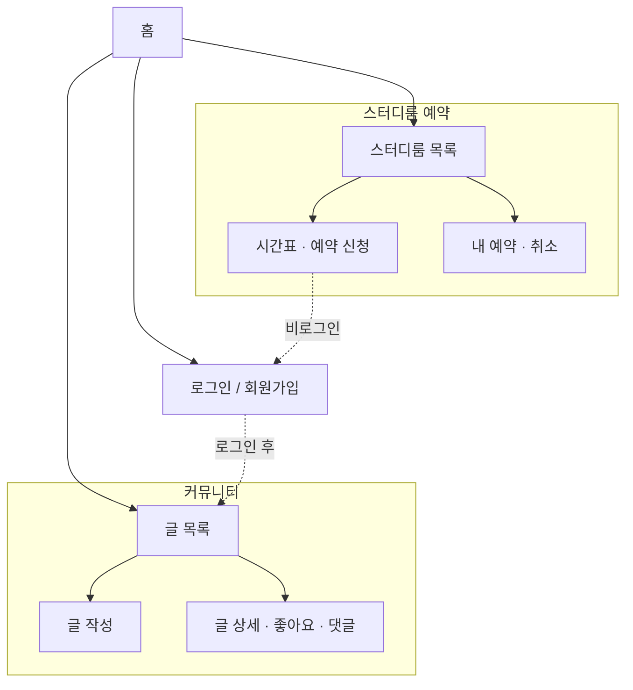

# Study Community — Frontend

스터디 그룹을 위한 **커뮤니티 + 스터디룸 예약** 웹 서비스의 프론트엔드입니다.
회원으로 가입해 글을 쓰고 의견을 나누며, 필요한 시간에 스터디룸을 예약할 수 있습니다.

---

## 주요 기능

### 회원

- **회원가입 / 로그인** — 이메일과 비밀번호로 계정을 만들고 로그인합니다.
- **자동 로그인 유지** — 한 번 로그인하면 브라우저를 닫았다 다시 열어도 로그인 상태가 유지됩니다.
- **로그아웃** — 헤더에서 언제든 로그아웃할 수 있습니다.

### 커뮤니티 게시판

- **글 목록 보기** — 전체 게시글을 최신순으로 한눈에 확인합니다. 각 카드에는 제목, 작성자, 작성일, 좋아요 수, 댓글 수가 표시됩니다.
- **글 작성** — 로그인한 사용자는 제목과 내용을 입력해 새 글을 등록할 수 있습니다.
- **글 상세 보기** — 본문 전체와 댓글을 확인합니다.
- **글 삭제** — 본인이 쓴 글만 삭제할 수 있습니다.
- **좋아요** — 글에 좋아요를 누르거나 취소합니다. 같은 글에는 한 번만 누를 수 있습니다.
- **댓글** — 글에 댓글을 달고, 본인이 단 댓글은 삭제할 수 있습니다.

### 스터디룸 예약

- **스터디룸 목록** — 위치·수용 인원·편의 시설(화이트보드, 모니터 등)과 함께 예약 가능한 모든 스터디룸을 보여줍니다.
- **시간표 기반 예약** — 원하는 날짜를 고르면 09:00 ~ 21:00 시간대 표가 나타나고,
  - 이미 **예약된 시간**, **지난 시간**, **예약 가능한 시간**이 색상으로 구분됩니다.
  - 시작 시간과 종료 시간을 클릭으로 선택해 한 번에 시간 범위를 잡습니다.
- **예약 신청** — 선택한 시간대에 사용 목적을 적어 예약을 신청합니다. 비로그인 상태에서는 로그인 페이지로 안내합니다.
- **내 예약 목록** — 내가 신청한 모든 예약을 한 곳에서 확인합니다.
- **예약 취소** — 필요 없어진 예약을 직접 취소할 수 있습니다.
- **중복 예약 방지** — 이미 잡힌 시간과 겹치면 서버 검증으로 막아주며, 사유를 안내합니다.

---

## 화면 흐름



---

## 사용해보기

```bash
# 1. 의존성 설치
npm install

# 2. 개발 서버 실행
npm run dev
```

브라우저에서 [http://localhost:3000](http://localhost:3000) 으로 접속하세요.

기본 진입 동선

1. **회원가입** → 이메일·비밀번호로 계정 생성
2. **로그인** → 토큰 발급, 헤더에 사용자 이름 표시
3. **커뮤니티** → 글 작성 / 댓글 / 좋아요
4. **스터디룸 예약** → 룸 선택 → 시간표에서 원하는 시간 클릭 → 예약 신청
5. **내 예약** → 신청한 예약 확인 및 취소

### 환경 변수

백엔드 API 주소는 환경 변수로 바꿀 수 있습니다.

```bash
# .env.local
NEXT_PUBLIC_API_URL=http://localhost:8000/api
```

설정하지 않으면 기본값으로 배포된 API(`https://study-community-backend.vercel.app/api`)를 사용합니다.

---

## 기술 스택 (한눈에)

| 구분       | 사용 기술                             |
| ---------- | ------------------------------------- |
| 프레임워크 | Next.js 16 (App Router) + React 19    |
| 언어       | TypeScript                            |
| 스타일링   | Tailwind CSS 4, shadcn/ui, Pretendard |
| 상태 관리  | Zustand (인증 상태)                   |
| 통신       | Axios (JWT 토큰 자동 첨부)            |
| 백엔드     | 별도 REST API 서버                    |
